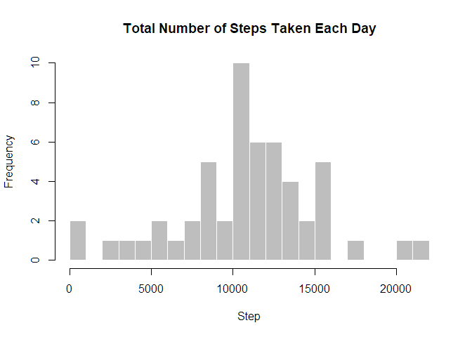
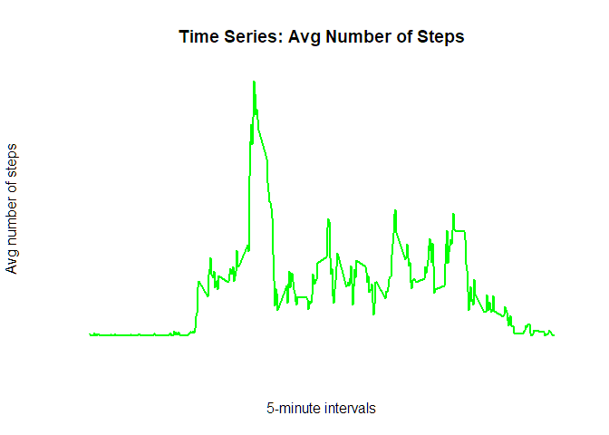
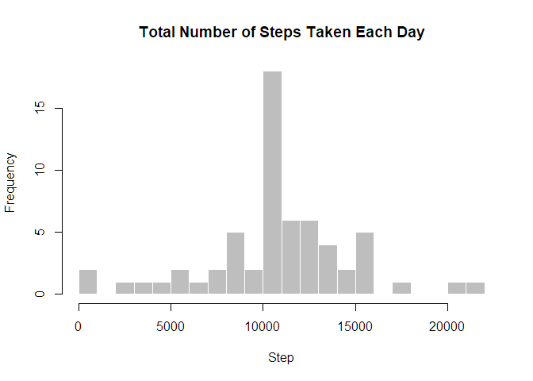
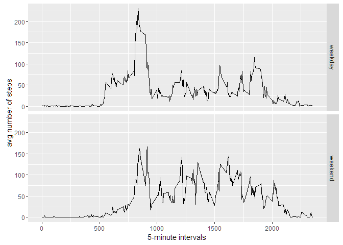

# Reproducible Research: Peer Assessment 1
Richard Loukota  
14 října 2017  


# Reproducible Research / Peer-graded Assignment: Course Project 1

## Loading and preprocessing the data

Prepare the environment


```r
library(knitr)
library(dplyr)
```

```
## Warning: package 'dplyr' was built under R version 3.3.3
```

```
## 
## Attaching package: 'dplyr'
```

```
## The following objects are masked from 'package:stats':
## 
##     filter, lag
```

```
## The following objects are masked from 'package:base':
## 
##     intersect, setdiff, setequal, union
```

```r
library(ggplot2)
library(scales)
```


Load the data and Process/transform the data into a format suitable for your analysis
1. Load the data (i.e. read.csv())


```r
if(!file.exists('activity.csv')){
    unzip('activity.zip')
}
activity <- read.csv('activity.csv', header = TRUE, sep = ",")
```

## What is mean total number of steps taken per day?

1. Calculate the total number of steps taken per day

```r
activityDay <- activity %>% group_by(date) %>% summarise(daySteps = sum(steps))
```

2. Make a histogram of the total number of steps taken each day

```r
activityDay$date <- as.Date(activityDay$date, format = "%Y-%m-%d")
activityDay$num <- as.numeric(activityDay$date)
hist(activityDay$daySteps, breaks = 20, main = "Total Number of Steps Taken Each Day", 
     col = "grey", border = "white", xlab = "Step", axes = TRUE)
```

<!-- -->

3.Calculate and report the mean and median of the total number of steps taken per day

```r
cat(paste("The mean is", mean(activityDay$daySteps, na.rm = TRUE)))
```

```
## The mean is 10766.1886792453
```

```r
cat(paste("The median is", median(activityDay$daySteps, na.rm = TRUE)))
```

```
## The median is 10765
```


## What is the average daily activity pattern?

1. Make a time series plot (i.e. type = "l") of the 5-minute interval (x-axis) and the average number of steps taken, averaged across all days (y-axis)

```r
avgSteps <- aggregate(steps ~ interval, data = activity, mean, na.rm = TRUE)
plot(avgSteps$interval, avgSteps$steps, type = "l", lwd = 2, col = "green",
     main = "Time Series: Avg Number of Steps", axes = FALSE,
     xlab = "5-minute intervals", ylab = "Avg number of steps")
```

<!-- -->

2.Which 5-minute interval, on average across all the days in the dataset, contains the maximum number of steps?

```r
avgSteps$interval[which.max(avgSteps$steps)]
```

```
## [1] 835
```

## Imputing missing values

1. Calculate and report the total number of missing values in the dataset (i.e. the total number of rows with NAs)

```r
sum(is.na(activity))
```

```
## [1] 2304
```

2.Devise a strategy for filling in all of the missing values in the dataset. The strategy does not need to be sophisticated. For example, you could use the mean/median for that day, or the mean for that 5-minute interval, etc.

 My strategy is to use the mean of the 5-minute intervals to fill the values into the missing values.

3. Create a new dataset that is equal to the original dataset but with the missing data filled in.

```r
newActivity <- activity

for(i in 1:nrow(newActivity)) {
    if(is.na(newActivity$steps[i])) {
        newActivity$steps[i] <- mean(newActivity$steps[newActivity$interval == newActivity$interval[i]], na.rm = TRUE)
    }
}

sum(is.na(newActivity))
```

```
## [1] 0
```

4. Make a histogram of the total number of steps taken each day and Calculate and report the mean and median total number of steps taken per day. Do these values differ from the estimates from the first part of the assignment? 
What is the impact of imputing missing data on the estimates of the total daily number of steps?

```r
newActivityDay <- newActivity %>% group_by(date) %>% summarise(daySteps = sum(steps))
newActivityDay$date <- as.Date(newActivityDay$date, format = "%Y-%m-%d")
newActivityDay$num <- as.numeric(newActivityDay$date)
hist(newActivityDay$daySteps, breaks = 20, main = "Total Number of Steps Taken Each Day", 
    col = "grey", border = "white", xlab = "Step", axes = TRUE)
```

<!-- -->

```r
cat(paste("The new mean is", mean(newActivityDay$daySteps, na.rm = TRUE)))
```

```
## The new mean is 10766.1886792453
```

```r
cat(paste("The new median is", median(newActivityDay$daySteps, na.rm = TRUE)))
```

```
## The new median is 10766.1886792453
```
Do these values differ from the estimates from the first part of the assignment?

```r
cat(paste("The difference of means is", (mean(activityDay$daySteps, na.rm = TRUE) - mean(newActivityDay$daySteps, na.rm = TRUE))))
```

```
## The difference of means is 0
```

```r
cat(paste("The difference of medians is", (median(activityDay$daySteps, na.rm = TRUE) - median(newActivityDay$daySteps, na.rm = TRUE))))
```

```
## The difference of medians is -1.1886792452824
```

## Are there differences in activity patterns between weekdays and weekends?

For this part the weekdays() function may be of some help here. 
Use the dataset with the filled-in missing values for this part.

1. Create a new factor variable in the dataset with two levels – “weekday” and “weekend” indicating whether a given date is a weekday or weekend day.

```r
newActivity$dateType <-  ifelse(as.POSIXlt(newActivity$date)$wday %in% c(0,6), 'weekend', 'weekday')
newAvgSteps <- aggregate(steps ~ interval + dateType, newActivity, mean)
ggplot(newAvgSteps, aes(interval, steps)) + geom_line() + 
    facet_grid(dateType ~ ., scales="fixed", space="fixed") + 
    xlab("5-minute intervals") + ylab("avg number of steps")
```

<!-- -->
